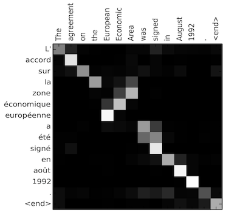
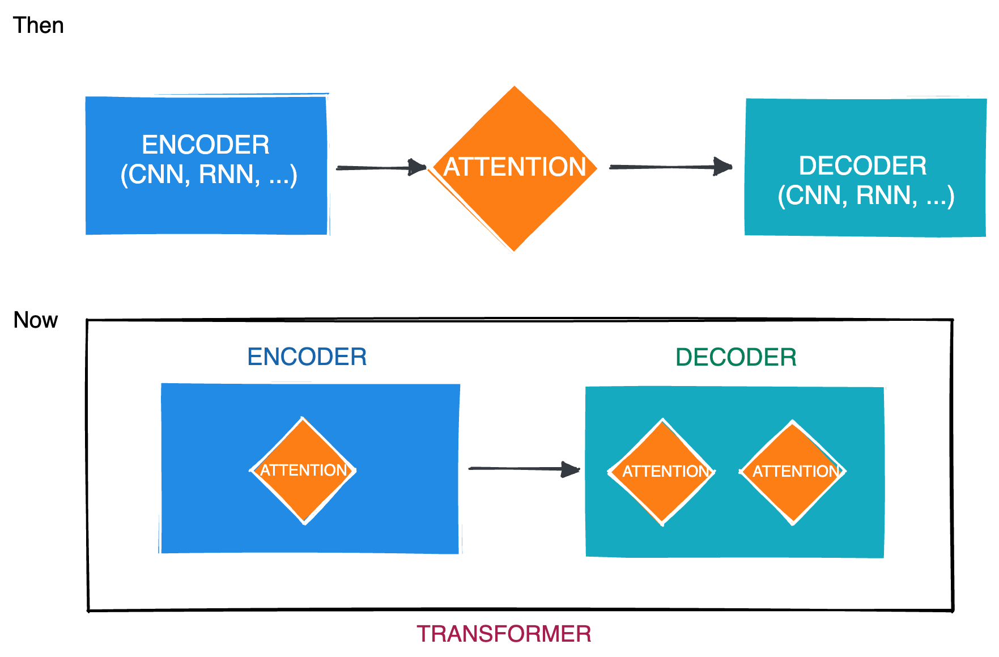
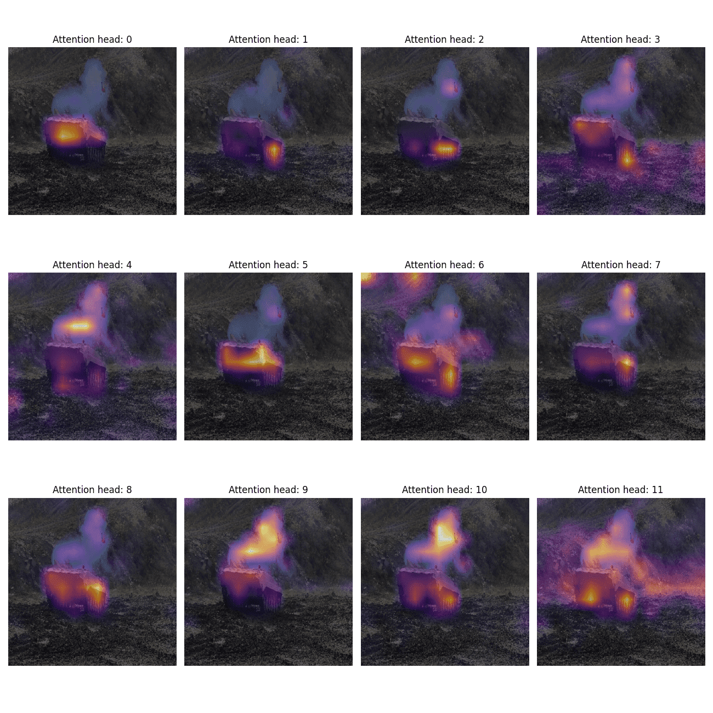

# LEARN TRANSFORMERS: Foundation Skills for Intermediate Computer Vision Engineers

## Description

- Material Lecture = https://courses.thinkautonomous.ai/view/courses/transformers
- Lecturer = Jeremy Cohen

## Course Material

### Attention & Transformers

#### Video: What is Attention?

- The idea of Query, Key, and Value is at the heart of what we call Dot Product Attention, or Scaled Dot Product Attention
- Step:
  - Step 1
  - Step 2 (Scale)
  - Step 3 (Mask is not on the formula)
  - Step 4 (Softmax)
  - Step 5 ($\text{Softmax}\times{value}$)

#### Recap: The Attention Timeline

- Many people state that Attention was born in 2017 with the paper "Attention is all you need", but it wasn't. Attention comes from the paper in 2014 (yes, this is old!) from the paper "[Neural Machine Translation by Jointly Learning to Align and Translate](https://arxiv.org/pdf/1409.0473.pdf)" by Bahdanau et al.
- Using "Additive Attention", they're able to build attention matrices based on sentences:

    

- Notice how the words "zone economique européenne" are reversed in english "european economic area" and therefore attention switches in the middle of the matrix.
- Since 2017, this way of doing attention has died, and has been replaced with transformers. This time, we don't need to plug attention in the middle of Encoders & Decoders, we can directly use Transformers, made of several Attention layers.

    

#### Other types of Attention

- Attention has several different forms/types
  - [Scaled Dot Product Attention](https://paperswithcode.com/method/scaled)
  - [Additive Attention](https://arxiv.org/pdf/1409.0473.pdf)
  - [General Attention](https://arxiv.org/pdf/1508.4025.pdf)
  - [Dot Product](https://arxiv.org/pdf/1508.4025.pdf)
  - [Location-Based Attention](https://arxiv.org/pdf/1508.04025.pdf)
  - [Content-Based Attention](https://arxiv.org/abs/1410.5401.pdf)
- Based on categories of attention
  - [Self-Attention](https://arxiv.org/pdf/1601.06733.pdf)
  - [Soft vs Hard Attention](http://proceedings.mlr.press/v37/xuc15.pdf)
    - Soft attention is when we have access to the entire image. Hard attention is when we have access to only a patch of the image. Read more on this [article in Medium](https://towardsdatascience.com/attention-in-neural-networks-e66920838742)
  - [Local vs Global Attention](http://proceedings.mlr.press/v37/xuc15.pdf)

#### How to Visualize Attention Maps without Code

- The searchers at HuggingFace have done an incredible job to make lots of Deep Learning models directly available for users. And they've done countless hours of work on Attention. If you'd like to visualize the attention maps, drag & drop any image in their "Attention Heatmaps" space, and see the result!

  [https://huggingface.co/spaces/probing-vits/attention-heat-maps](https://huggingface.co/spaces/probing-vits/attention-heat-maps)

- If broken, use this one: [https://huggingface.co/spaces/TexR6/AttentionMaps](https://huggingface.co/spaces/TexR6/AttentionMaps)
- **Example Heatmaps**: Notice how the attention never focuses on the ground (for that use case and model), and always focuses on the tank, or the smoke!

    

#### Video: Transformers

### Vault: Research Paper Study
